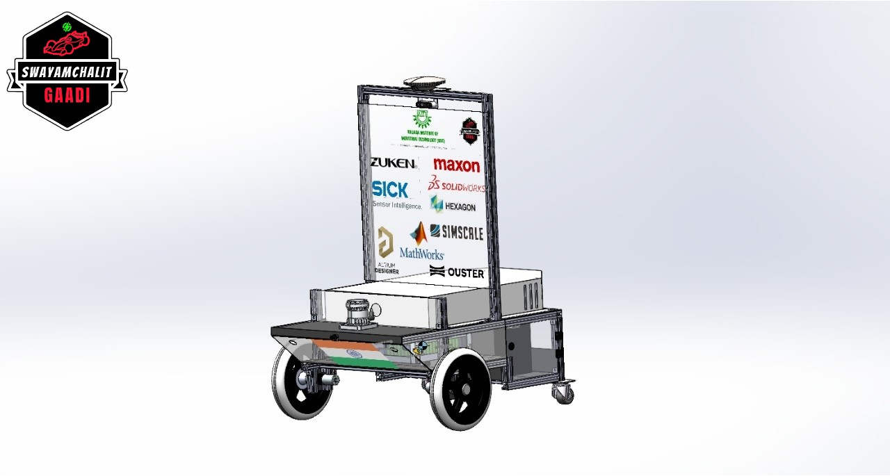

# Swayamchalit Gaadi <br>  

<br>

# About Swayamchalit Gaadi (Project SwaG)

Project Swayamchalit Gaadi,the first self-driving car team from Odisha currently working on Level-4 Autonomous vehicles and small-scale self-driving car prototypes. It was started in 2019 with the vision of our founders [Anshuman Parhi](https://www.linkedin.com/in/anshuman-parhi/), [Anand Golla](https://www.linkedin.com/in/anandgolla/) and our respected seniors under the mentorship of [Prof. Isham Panigrahi](https://www.linkedin.com/in/isham-panigrahi-9a192797/).<br>
We aim to build a completely homegrown autonomous vehicle and represent it on international grounds. We intend to represent our college and country at IGVC and Formulae Student Germany.

This document will give you a brief description of the repo's layout and an overview of the repo.
For more detailed information about our team, check out our social media pages:<br>
<p>
   <a href="https://www.instagram.com/swayamchalit_gaadi/">
  </a>  
</p>
<p>
   <a href="https://www.linkedin.com/company/teamswag/">
  </a>  
</p>

# Our Hard Working and Amazing Team
## Team Manager
[](https://www.linkedin.com/in/abhishek-kolay-a898061a5/)

## Team Lead
[](https://www.linkedin.com/in/abhisek-omkar-prasad-70937a173/)

### Members of ROS Team
[](https://www.linkedin.com/in/pradumn203/)<br>
[](https://www.linkedin.com/in/urja-jain-020301/)<br>
[](https://www.linkedin.com/in/anas-khan-731846219/)

### Members of Software Stack
[](https://www.linkedin.com/in/aaryaman-bhardwaj-768a22131/)<br>
[](https://www.linkedin.com/in/ashish-arya-65923b16b/)<br>
[](https://www.linkedin.com/in/uday-bhanu-ghosh-091a12193/)

### Members of Mechanical Team
[](https://www.linkedin.com/in/pallabika-bora-a735391b6/)<br>
[](https://www.linkedin.com/in/soubhagya-ranjan/)<br>
[](https://www.linkedin.com/in/sagnik-ghosh-1a5789208/)


# Folder Structure
The repo is comprised of multiple ROS packages and one sandbox folder for miscellaneous resources.
 * **swag_description**
    *URDF files for our robot and meshes for gazebo, description files for obstacles like barrels and ramps*
 * **swag_gazebo**
    *Contains simulations plugins which helps to initiate simulation*
 * **swag_msgs**
    *All customized ROS messages which has been used throughout the package*
 * **swag_navigation**
    *Collection of nodes for navigation, path-planning(includes setting waypoints) and localization*
 * **swag_perception**
    *Collection of nodes which perform pointcloud filters, image segmentation and sensor fusion the whole of which forms our perception stack*
 * **igvc_platform**
    *Nodes that are platform specific and used to communicate with the hardware, ie. IMU, joystick and motor controller*
 * **swag_documentation**
    *A brief document about our whole package and some basic knowledge required*

 * **Rest all stuff are standard ros packages used for small purposes which we used during our testing and raw operations phase**

# Building Code
 For an installation guide for ROS, check out the official ROS Installation page
 [ROS Official installation page](http://wiki.ros.org/ROS/Installation).

1. Clone the repository (with the git submodules) into the src directory of a catkin workspace:
    ```bash
    git clone https://github.com/Project-SwaG/swag-igvc-simulator --recursive
    ```

2. Install dependencies:
    ```bash
    cd swag-igvc-simulator
    # The below command will install them all.
    rosdep install --from-paths src --ignore-src
    
    # Very rarely you will need to run this bash file
    ./install_dependencies.sh
    ```

3. Use `catkin_make` in the workspace to build all the packages:
    ```bash
    catkin_make
    ```

4. Make sure the `devel/setup.bash` is sourced before using any of the nodes in this package:
    ```bash
   source devel/setup.bash
    ```

## Common Errors
- `Could not find a package configuration file provided by "parameter_assertions" with any of the following names:`
    - `parameter_assertions` comes from a git submodule. Initialize the submodules by doing
    `git submodule update --init --recursive`
- `Could not find a package configuration file provided by "XXXX" with any of the following names:"`
    - Make sure you have ran `rosdep install --from-paths src --ignore-src` in the `catkin_ws` folder already
    - If you still get this error after installing all dependencies, then that means that we forgot to include
    that package in our dependencies list.
    [File an issue](https://github.com/Project-SwaG/swag-igvc-simulator/issues) with the error message.


# Running the simulation in Gazebo
You can get started with the simulation of the Swayamchali Gaadi using our simulator. Just need to follow the below steps:

**Load the robot into a Gazebo world:**
The following command will do that for you:
```
roslaunch swag_gazebo simulation.launch
```

**Navigation the Vehicle:**
To launch the navigation stack for simulation:
```bash
roslaunch swag_navigation navigation_simulation.launch
```

Alternatively, you can control the robot manually using a keyboard:<br>
*For this feature we have used the standard ROS teleop package*
```
rosrun teleop_twist_keyboard teleop_twist_keyboard.py
```

